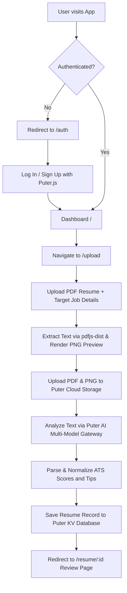

# 📄 Resumind — AI Resume Analyzer & ATS Scorer

<div align="center">
  
  <br /><br />

  <div>
    
    
    
    
    
    
  </div>

  <br />
  <p align="center">
    <strong>Smart feedback for your dream job!</strong><br />
    An AI-powered ATS resume analyzer built with React 19, React Router v7, and Puter.js — featuring serverless auth, cloud storage, client-side PDF text extraction, and multi-model AI scoring.
  </p>
</div>

---

## 📋 Table of Contents

- [✨ Features](#-features)
- [⚙️ Tech Stack](#️-tech-stack)
- [📁 Project Structure](#-project-structure)
- [🚀 Quick Start](#-quick-start)
- [🧠 How It Works](#-how-it-works)
- [🔒 Authentication & Data Privacy](#-authentication--data-privacy)
- [🤖 AI Scoring Categories](#-ai-scoring-categories)
- [🛠️ Available Scripts](#️-available-scripts)
- [📄 License](#-license)

---


## ✨ Features

- 🔐 **Puter.js Serverless Authentication**:
  - Sign in or sign up seamlessly using **Google, Microsoft, Apple, or Email**.
  - Secure session management with zero custom backend infrastructure required.

- 📄 **Client-Side PDF Processing**:
  - In-browser text extraction using **`pdfjs-dist`** for 100% accurate resume reading.
  - Automatic PDF page rendering to high-resolution PNG previews using HTML5 Canvas.

- 🎯 **Intelligent ATS & Resume Scoring**:
  - Detailed **ATS Suitability Score (0-100)** with keyword matching and formatting suggestions.
  - Category breakdown: **Tone & Style**, **Content Quality**, **Structure**, and **Skills**.
  - Job-specific evaluation when target Job Title and Job Description are provided.

- ☁️ **Private Cloud Storage & KV Database**:
  - Resumes (`.pdf`) and preview images (`.png`) are stored in the user's private Puter Cloud File System (`puter.fs`).
  - Analysis results and ATS reports are stored in Puter's Key-Value Database (`puter.kv`).
  - Cross-device sync: access your past submissions anywhere.

- ⚡ **Multi-Model Fallback Engine**:
  - Resilient AI pipeline supporting **GPT-4o**, **GPT-4o-mini**, **Claude 3.5 Sonnet**, **Gemini 2.0 Flash**, and default Puter AI models.
  - Zero API key setup required — all costs are handled by Puter's free user tier.

- 🎨 **Modern & Responsive UI**:
  - Built with Tailwind CSS v4 and animated micro-interactions.
  - Interactive SVG score gauges, circular score rings, and collapsible category accordions.

---

## ⚙️ Tech Stack

| Layer | Technology | Purpose |
|---|---|---|
| **Framework** | [React 19](https://react.dev/) | Core UI component architecture |
| **Routing** | [React Router v7](https://reactrouter.com/) | Nested routes, loaders, actions, and route guards |
| **Cloud & AI Backend** | [Puter.js v2](https://puter.com/) | Serverless Auth, Cloud Storage (`fs`), KV Database (`kv`), and AI Chat (`ai`) |
| **Styling** | [Tailwind CSS v4](https://tailwindcss.com/) | Utility-first CSS styling and custom theme variables |
| **PDF Processing** | [PDF.js (`pdfjs-dist`)](https://mozilla.github.io/pdf.js/) | Client-side PDF text extraction and Canvas image rendering |
| **State Management** | [Zustand](https://github.com/pmndrs/zustand) | Global reactive state for Puter authentication and storage |
| **File Upload** | [React Dropzone](https://react-dropzone.js.org/) | Drag-and-drop PDF resume uploader |
| **Build Tool** | [Vite 6](https://vite.dev/) | Lightning-fast development server and production bundler |
| **Language** | [TypeScript](https://www.typescriptlang.org/) | End-to-end static type safety |

---

## 📁 Project Structure

```
ai-resume-analyzer/
├── app/
│   ├── components/            # UI Components
│   │   ├── Accordion.tsx      # Animated expandable accordion for feedback details
│   │   ├── ATS.tsx            # ATS score card with tips and status indicators
│   │   ├── Details.tsx        # In-depth category breakdown with score badges
│   │   ├── FileUploader.tsx   # Drag-and-drop PDF resume upload zone
│   │   ├── Navbar.tsx         # Top navigation bar with user profile & logout
│   │   ├── ResumeCard.tsx     # Dashboard card displaying resume preview and score
│   │   ├── ScoreBadge.tsx     # Color-coded score pill badge
│   │   ├── ScoreCircle.tsx    # Circular SVG progress gauge
│   │   ├── ScoreGauge.tsx     # Semi-circular gradient arc gauge
│   │   └── Summary.tsx        # Overview score breakdown
│   ├── lib/                   # Utility Libraries
│   │   ├── pdf2img.ts         # PDF text extraction & Canvas image rendering
│   │   ├── puter.ts           # Zustand store integrating Puter.js (Auth, FS, AI, KV)
│   │   └── utils.ts           # Helper functions (cn, formatSize, generateUUID)
│   ├── routes/                # Application Routes
│   │   ├── auth.tsx           # /auth - Welcome screen & Puter social login modal
│   │   ├── home.tsx           # / - User dashboard with past resume evaluations
│   │   ├── resume.tsx         # /resume/:id - Detailed resume feedback & preview view
│   │   ├── upload.tsx         # /upload - Resume upload & AI analysis flow
│   │   └── wipe.tsx           # /wipe - Maintenance route to reset user data
│   ├── app.css                # Tailwind CSS v4 custom theme & utility classes
│   ├── root.tsx               # Root layout & Puter.js script loader
│   └── routes.ts              # Route definitions for React Router v7
├── constants/
│   └── index.ts               # Sample mock resumes, AI prompts, and response format
├── public/                    # Static assets, SVG icons, and PDF worker
│   ├── icons/                 # UI icons (check, warning, back, info, ats badges)
│   ├── images/                # Background SVGs and animations
│   └── pdf.worker.min.mjs     # Standalone worker script for pdfjs-dist
├── types/
│   ├── index.d.ts             # Domain interfaces (Resume, Feedback, CategoryScore)
│   └── puter.d.ts             # Puter.js SDK type definitions
├── package.json               # Dependencies and scripts
├── tsconfig.json              # TypeScript compiler configuration
├── vite.config.ts             # Vite configuration with Tailwind CSS plugin
└── react-router.config.ts     # React Router v7 configuration
```

---

## 🚀 Quick Start

### Prerequisites

Ensure you have the following installed on your machine:
- [Node.js](https://nodejs.org/) (version **18.0** or higher)
- [npm](https://www.npmjs.com/) (Node Package Manager)

### Installation

1. **Clone the repository:**
   ```bash
   git clone https://github.com/your-username/ai-resume-analyzer.git
   cd ai-resume-analyzer
   ```

2. **Install dependencies:**
   ```bash
   npm install
   ```

3. **Start the development server:**
   ```bash
   npm run dev
   ```

4. **Open in browser:**
   Navigate to [http://localhost:5173](http://localhost:5173) to view the application.

---

## 🧠 How It Works



1. **Authentication Check**: The app verifies your Puter.js session. Unauthenticated users are guided to `/auth`.
2. **File Processing**: When you select a PDF resume, `pdfjs-dist` extracts the raw text content in your browser and renders page 1 to an image.
3. **Cloud Upload**: The PDF and preview PNG are uploaded to your private Puter cloud file system (`fs`).
4. **AI Analysis**: Puter AI evaluates your extracted resume text against ATS standards and your target job description.
5. **Score & Storage**: Scores and categorized suggestions are normalized and stored in Puter's key-value database (`kv`).
6. **Detailed Review**: You are redirected to `/resume/:id` to view your resume side-by-side with your ATS scores and actionable tips.

---

## 🔒 Authentication & Data Privacy

- **No External Backend**: There is no custom SQL or MongoDB server hosting your private resumes.
- **Client-Side Security**: All files and database entries belong directly to your **Puter.com** account.
- **Inspect Your Data**: You can visit [puter.com](https://puter.com) at any time to view your stored files or manage permissions.

---

## 🤖 AI Scoring Categories

Resumind evaluates your resume across 5 critical dimensions:

1. **Overall Score (`0 - 100`)**: Weighted composite score reflecting general resume strength.
2. **ATS Suitability (`0 - 100`)**: Analyzes file format, standard section headers, and keyword alignment.
3. **Tone & Style (`0 - 100`)**: Checks for strong action verbs, professional tone, and active voice.
4. **Content Quality (`0 - 100`)**: Evaluates quantifiable metrics, achievements, and impact.
5. **Structure & Formatting (`0 - 100`)**: Reviews visual hierarchy, section organization, and readability.
6. **Skills & Keywords (`0 - 100`)**: Validates hard and soft skills against industry job descriptions.

---

## 🛠️ Available Scripts

In the project directory, you can run:

| Command | Description |
|---|---|
| `npm run dev` | Starts the local development server at `http://localhost:5173` |
| `npm run build` | Compiles and bundles the application for production |
| `npm run start` | Serves the production build with React Router server |
| `npm run typecheck` | Generates React Router types and runs TypeScript type verification |

---
